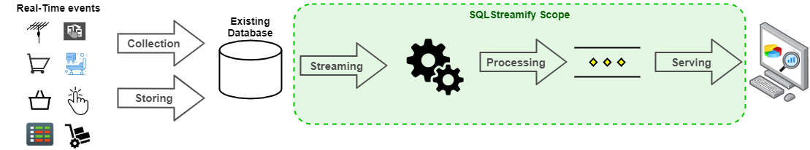
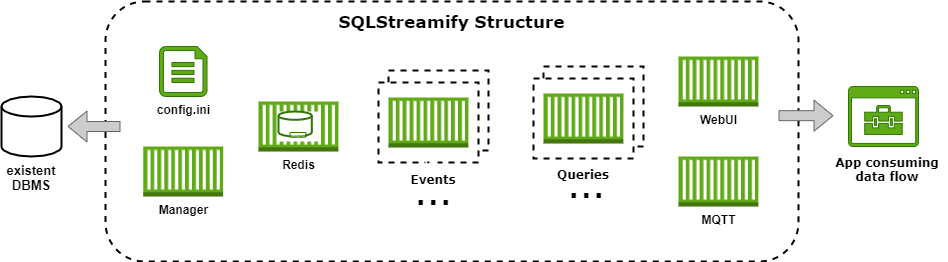
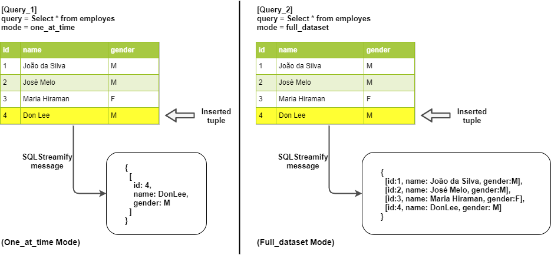

===

    

SQLStreamify is a simple and flexible middleware, with microservice-based architecture, capable of providing real-time data streams obtained by converting queries into continuous queries, without all the CEP tool complexity and with the possibility of execution without changes in legacy systems databases.

Is supported on Linux, Windows, and macOS. Running on [Docker](https://www.docker.com/) containers.

Pipeline
---
Comentar sobre o pipeline que é atendido pela ferramenta.

    

Structure
---

A estrutura do middleware, para explicar o funcionamento.

    

Delivery Modes
---

Modos de entrega.

* **One-at-time Mode**: explicar esse modo
* **Full-dataset Mode**: explicar esse modo

    

Quick Start
---

#### Pre-requisites
- Install Python
- Install Docker
- Enable MySQL binary log

#### Installing
- Clone this repo
- Adjust config.ini
    - Insert connections parameters
    - Create queries

#### Running
- Execute start_service.py

#### Monitoring
- Dashboard will be avaiable on 8080 port.

