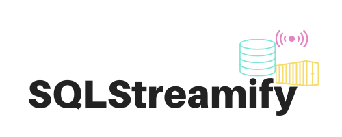

===

    

SQLStreamify is a simple and flexible middleware, with microservice-based architecture, capable of providing real-time data streams obtained by converting queries into continuous queries, without all the CEP tool complexity and with the possibility of execution without changes in legacy systems databases.

Is supported on Linux, Windows, and macOS. Running on [Docker](https://www.docker.com/) containers.

* Website: https://nomadproject.io
* Tutorials: [HashiCorp Learn](https://learn.hashicorp.com/nomad)
* Forum: [Discuss](https://discuss.hashicorp.com/c/nomad)
* Mailing List: [Google Groups](https://groups.google.com/group/nomad-tool)
* Gitter: [hashicorp-nomad](https://gitter.im/hashicorp-nomad/Lobby)

Nomad provides several key features:

* **Deploy Containers and Legacy Applications**: Nomad’s flexibility as an orchestrator enables an organization to run containers, legacy, and batch applications together on the same infrastructure.  Nomad brings core orchestration benefits to legacy applications without needing to containerize via pluggable task drivers.

* **Simple & Reliable**:  Nomad runs as a single binary and is entirely self contained - combining resource management and scheduling into a single system.  Nomad does not require any external services for storage or coordination.  Nomad automatically handles application, node, and driver failures.  Nomad is distributed and resilient, using leader election and state replication to provide high availability in the event of failures.

* **Device Plugins & GPU Support**: Nomad offers built-in support for GPU workloads such as machine learning (ML) and artificial intelligence (AI).  Nomad uses device plugins to automatically detect and utilize resources from hardware devices such as GPU, FPGAs, and TPUs.

* **Federation for Multi-Region, Multi-Cloud**: Nomad was designed to support infrastructure at a global scale.  Nomad supports federation out-of-the-box and can deploy applications across multiple regions and clouds.

* **Proven Scalability**: Nomad is optimistically concurrent, which increases throughput and reduces latency for workloads.  Nomad has been proven to scale to clusters of 10K+ nodes in real-world production environments.

* **HashiCorp Ecosystem**: Nomad integrates seamlessly with Terraform, Consul, Vault for provisioning, service discovery, and secrets management.

Pipeline
---

    

Structure
---

    

Delivery Modes
---

    

Quick Start
---

#### Testing
See [Learn: Getting Started](https://learn.hashicorp.com/collections/nomad/get-started) for instructions on setting up a local Nomad cluster for non-production use.

Optionally, find Terraform manifests for bringing up a development Nomad cluster on a public cloud in the [`terraform`](terraform/) directory.

#### Production
See [Learn: Nomad Reference Architecture](https://learn.hashicorp.com/tutorials/nomad/production-reference-architecture-vm-with-consul?in=nomad/production) for recommended practices and a reference architecture for production deployments.

Documentation
---
Full, comprehensive documentation is available on the Nomad website: https://www.nomadproject.io/docs

Guides are available on [HashiCorp Learn](https://learn.hashicorp.com/nomad).

Contributing
--------------------
See the [`contributing`](contributing/) directory for more developer documentation.