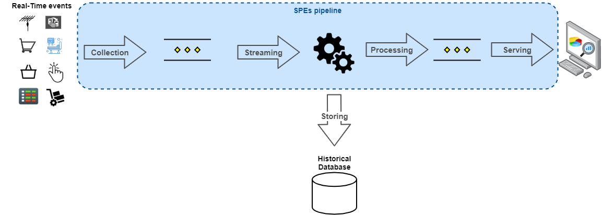

===

    

SQLStreamify is a simple and flexible middleware, with microservice-based architecture, capable of providing real-time data streams obtained by converting queries into continuous queries, without all the CEP tool complexity and with the possibility of execution without changes in legacy systems databases.

Is supported on Linux, Windows, and macOS. Running on [Docker](https://www.docker.com/) containers.

Pipeline
---
The usual pipeline for apps using data stream is presented in figure below, which shows storing data after collection and a basic processing. It is constantly named as Historical Database.

    

Nevertheless, there are cases where legacy applications record events collected in existing DBMSs. These data being updated in the database are the desired events for new applications that makes use of data streams from there. This is precisely the scope of the work. SQLStreamify transforms these events into flows by searching the data collected and stored in DBMSs.

    

SQLStreamify was proposed considering that developers constantly need real-time stream data reading functions in apps that use DBMSs. It delivers CQs based on data changes and notifies listeners when any change is made.

Structure
---

SQLStreamify structure consists of five microservices - Manager, Events, Queries, WebUI and MQTT-Broker. Besides these services, a Redis NoSQL database is used as storage. Its function is to provide a high performance and fast storage, once the main memory is used as storage, where all microservices can access to exchange data among them.

    

Delivery Modes
---

Modos de entrega.

* **One-at-time Mode**: One-at-time mode is the most logical alternative to send data stream. Whenever any change is observed, they are sent one by one.
* **Full-dataset Mode**: According to the semantics of the situation, the developer must choose how the data will be sent. Full-dataset received this name because of the need to send the entire result of the query registered by the user when the changes occur. Some cases that may need it are queries in which there is a data summary, such as a counter, groupings or data calculation. Another case that requires this mode is the ordered listings that limit the search, for example, the last ten sales for a given state. In this example listing, when any change is noticed, all query data are change and depending on the application scenario, the entire dataset is required.

    

Quick Start
---

#### Pre-requisites
- Install Python
- Install Docker
- Enable MySQL binary log

#### Installing
- Clone this repo
- Adjust **config.ini**
    - Database access parameters
    - Data stream exposing configs
    - Create queries, name, SQL and type

#### Running
- Execute start_service.py

#### Monitoring
- Dashboard will be avaiable on 8080 port.

#### Consuming
- Developers can use MQTT or WebSTOMP methods to get data streams from broker, using CQ giving name on config.ini.

#### Examples
- Some use case examples are available on repository.